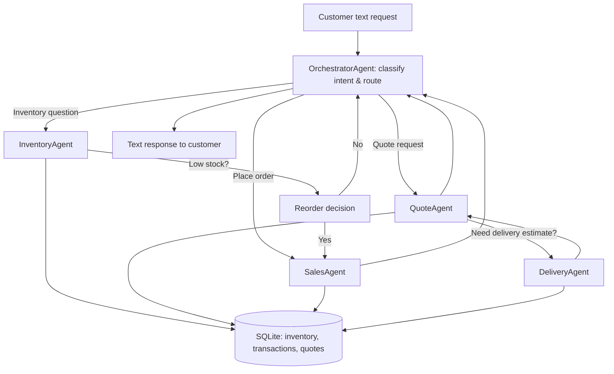

```mermaid
flowchart TD
    U[Customer text request] --> O[OrchestratorAgent: classify intent & route]

    O -->|Inventory question| IA[InventoryAgent]
    O -->|Quote request| QA[QuoteAgent]
    O -->|Place order| SA[SalesAgent]

    IA --> DB[(SQLite: inventory, transactions, quotes)]
    QA --> DB
    SA --> DB

    IA -->|Low stock?| R[Reorder decision]
    R -->|Yes| SA
    R -->|No| O

    QA -->|Need delivery estimate?| DA[DeliveryAgent]
    DA --> DB
    DA --> QA

    QA --> O
    SA --> O

    O --> OUT[Text response to customer]
```